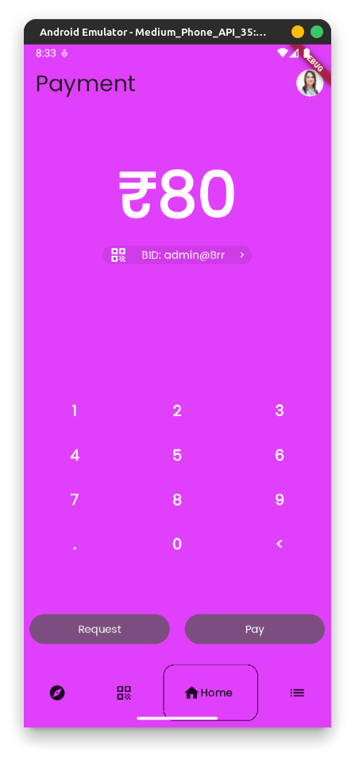
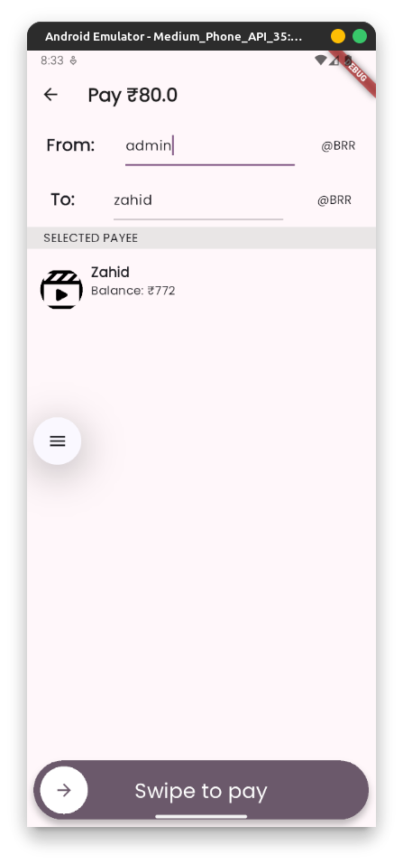
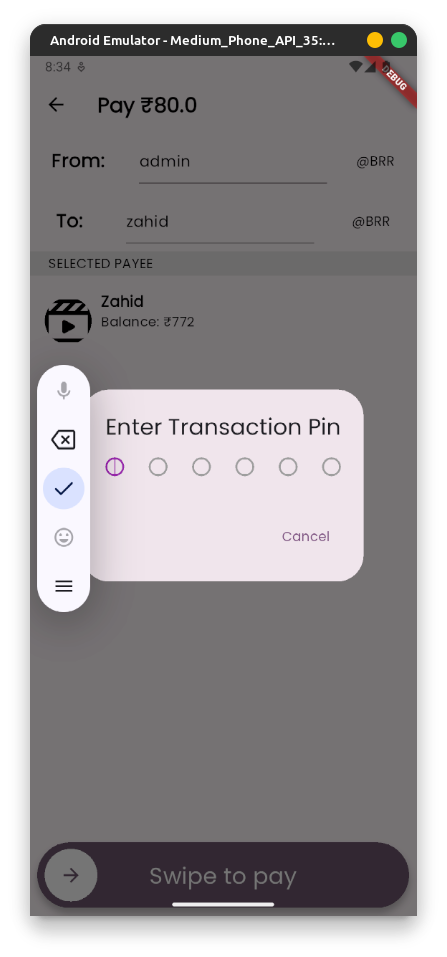
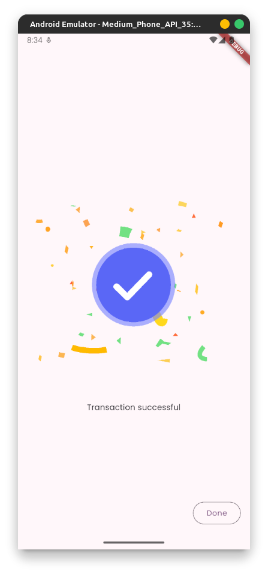
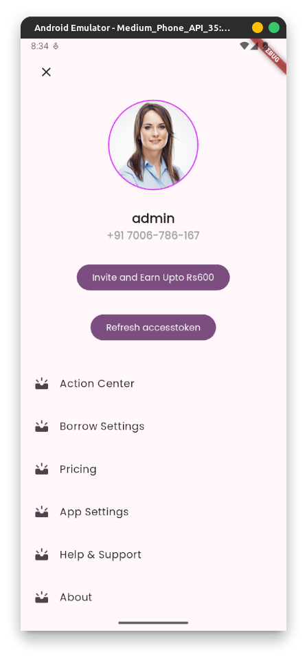
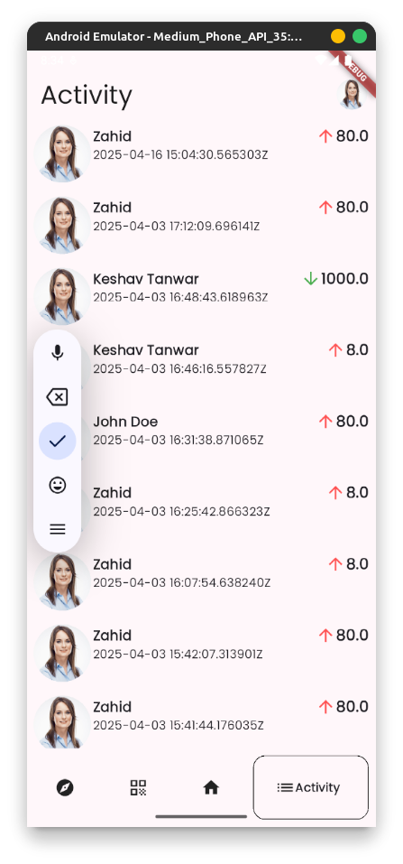
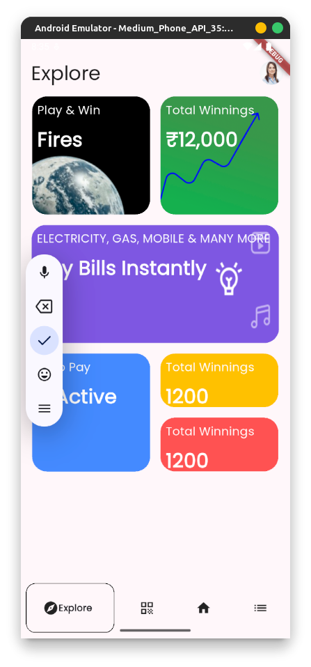

# Borrow App Lite

Borrow App Lite is a simple and user-friendly application designed to help people manage borrowing and lending of items, money, or tools between friends, family, or colleagues. Keep track of what you’ve lent or borrowed, with clear reminders and easy-to-use records!

---

## 🌟 Features

- 📋 Record items, amount, or tools borrowed or lent.
- 🔔 Get reminders for due dates.
- 📊 View complete history of borrow and return.
- 🔄 Mark items as returned or borrowed.
- 🧾 Simple and clean UI for fast interaction.

---

## 📱 Demo Screenshots

Here are some sample screenshots from Borrow App Lite:

1. 
2. 
3. 
4. 
5. 
6. 
7. 
8. 

---

## 🏗️ Tech Stack

- Flutter (Frontend)
- Django (Backend)
- Postgres (Database)

---

## 💡 How to Install

1. ```bash

   ```
